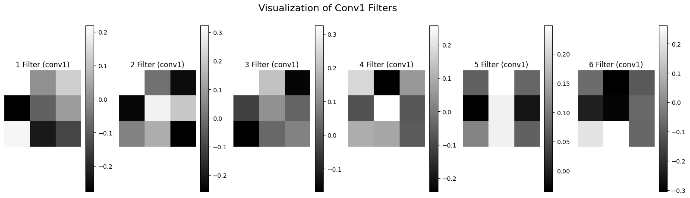
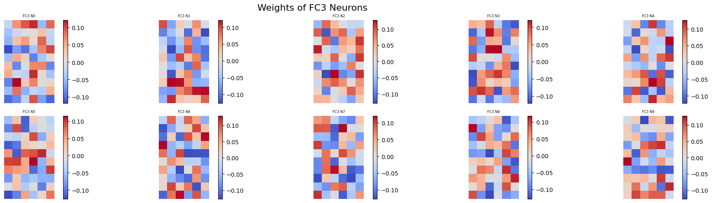

# Deep Learning Projects – TensorFlow, Keras & PyTorch
## Welcome to my Deep Learning repository.

This repository gathers a series of applied deep learning projects using TensorFlow, Keras, and PyTorch. Each project is organized in a clean and reproducible format to explore key machine learning concepts through concrete examples.

Contents
The projects cover a wide range of topics, including:

* **Image and Tabular Classification:** CNNs and fully connected networks on real-world datasets.

* **Regression Models:** Predictive tasks using both standard and custom metrics.

* **Custom Loss Functions & Metrics:** Implementation of tailored objectives adapted to specific tasks.

* **Training Techniques:** Integration of callbacks such as EarlyStopping, ModelCheckpoint, and Learning Rate Scheduling.

* **Comparative Experiments:** Exploration of model architectures, optimization algorithms, dropout, batch normalization, and regularization.

* **Model Evaluation:** Use of metrics such as accuracy, precision, recall, F1-score, ROC AUC, and visualizations for better interpretability.

* **Neural Network Visualizations:** Display and interpretation of learned weights for deeper insight into model behavior.

